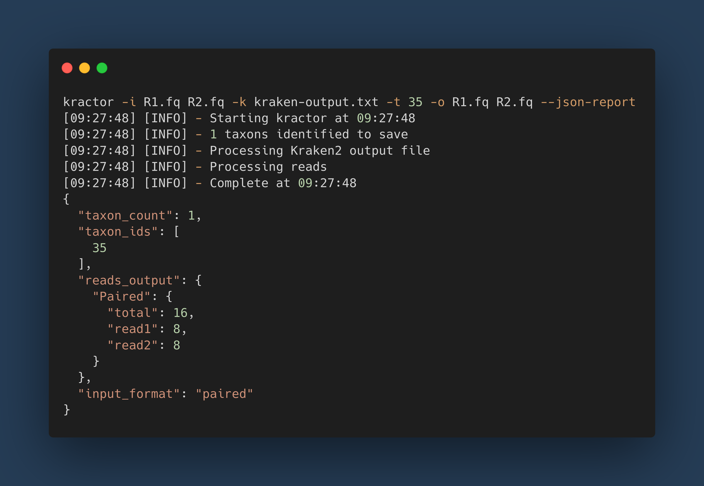

[](https://github.com/Sam-Sims/kractor/actions/workflows/test.yaml)
[](https://github.com/Sam-Sims/kractor/actions/workflows/check.yaml)

# kractor

**kra**ken extr**actor**

Kractor extracts sequencing reads based on taxonomic classifications obtained
via [Kraken2](https://github.com/DerrickWood/kraken2). It consumes paired or unpaired `fastq[.gz/.bz]` files as input
alongisde a Kraken2 standard output. It can optionally consume a Kraken2 report to extract all taxonomic parents and
children of a given taxid. Fast and multithreaded by default, it outputs `fast[q/a]` files, that can optionally be
compressed. Memory usage
is minimal, averaging ~4.5MB while processing a 17GB fastq file.

The end result is a `fast[q/a]` file containing all reads classified as the specified taxon.

Kractor significantly enhances processing speed compared to KrakenTools for both paired and unpaired reads. Paired reads
are processed approximately 21x quicker for compressed fastqs and 10x quicker for uncompressed. Unpaired reads are
approximately 4x faster for both compressed and uncompressed inputs.

For additional details, refer to the [benchmarks](benchmarks/benchmarks.md)

## Motivation

Inspired by [KrakenTools](https://github.com/jenniferlu717/KrakenTools).

The main motivation was to enchance speed when parsing, extracting, and writing a large volume of reads - and also to
learn rust.

## Installation

### Binaries:


Precompiled binaries for Linux, MacOS and Windows are attached to the latest
release [1.0.0](https://github.com/Sam-Sims/kractor/releases/tag/kractor-1.0.0)

### Conda:


With conda installed, and bioconda channel correctly setup:

```
conda install kractor
```

### Docker:

A docker image is available on [quay.io](https://quay.io/repository/biocontainers/kractor)

```
docker pull quay.io/biocontainers/kractor
```

### Cargo:


Requires [cargo](https://www.rust-lang.org/tools/install)

```
cargo install kractor
```

### Build from source:

#### Install rust toolchain:

To install please refer to the rust documentation: [docs](https://www.rust-lang.org/tools/install)

#### Clone the repository:

```bash
git clone https://github.com/Sam-Sims/Kractor
```

#### Build and add to path:

```bash
cd Kractor
cargo build --release
export PATH=$PATH:$(pwd)/target/release
```

All executables will be in the directory Kractor/target/release.

## Usage



### Basic Usage:

```bash
kractor -k <kraken_output> -i <fastq_file> -t <taxonomic_id> -o <output_file> --json-report > kractor_report.json
```

Or, if you have paired-end illumina reads:

```bash
kractor -k <kraken_output> -i <R1_fastq_file> -i <R2_fastq_file> -t <taxonomic_id> -o <R1_output_file> -o <R2_output_file>
```

If you want to extract all children of a taxon:

```bash
kractor -k <kraken_output> -r <kraken_report> -i <fastq_file> -t <taxonomic_id> --children -o <output_file>
```

### Arguments:

### Required:

#### Input

`-i, --input`

This option will specify the input files containing the reads you want to extract from. They can be compressed - (`gz`,
`bz2`). Paired end reads can be specified by:

Using `--input` twice: `-i <R1_fastq_file> -i <R2_fastq_file>`

Using `--input` once but passing both files: `-i <R1_fastq_file> <R2_fastq_file>`

This means that bash wildcard expansion works: `-i *.fastq`

#### Output

`-o, --output`

This option will specify the output files containing the extracted reads. The order of the output files is assumed to be
the same as the input.

By default the compression will be inferred from the output file extension for supported file types (`gz`, `bz`). If the
output type cannot be inferred, plaintext will be output.

#### Kraken Output

`-k, --kraken`

This option will specify the path to the Kraken2 output containing taxonomic classification of read IDs.

#### Taxid

`-t, --taxid`

This option will specify the taxon ID for reads you want to extract. 

Multiple taxids can be specified:
`-t 1 2 10`.

Each taxid will adhere to `--exclude` `--parents` and `--children`

### Optional:

#### Output type

`-O, --output-type`

This option will manually set the compression mode used for the output file and will override the type inferred from the
output path.

Valid values are:

- `gz` to output gz
- `bz2` to output bz2
- `none` to not apply compresison

#### Compression level

`-l, --level`

This option will set the compression level to use if compressing the output. Should be a value between 1-9 with 1 being
the fastest but largest file size and 9 is for slowest, but best file size. By default this is set at 2 as it is a good
trade off for speed/filesize.

#### Output fasta

`--output-fasta`

This option will output a fasta file, with read ids as headers.

#### Kraken Report

`-r, --report`

This option specifies the path to the report file generated by Kraken2. If you want to use `--parents` or `--children`
then is argument is required.

#### Parents

`--parents`

This will extract reads classified at all taxons between the root and the specified `--taxid`.

#### Children

`--children`

This will extract all the reads classified as decendents or subtaxa of `--taxid` (Including the taxid).

#### Exclude

`--exclude`

This will output every read except those matching the taxid. Works with `--parents` and `--children`

#### JSON report

`--json-report`

This will output a json report that to stdout upon programme completion.

## Version

- 1.0.0