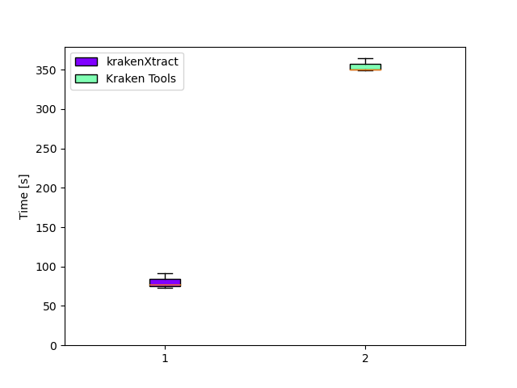

# Benchmarks:

Benchmarks were run in triplicate with 1 warmup run - using [hyperfine](https://github.com/sharkdp/hyperfine).

They were run on my own PC running Ubuntu in WSL2 (Plans to test in native linux):

- i7 12700k - 12 cores
- 32GB memory with 16GB Assigned to WSL2
- M.2 SSD drive

Hyperfine command:
```bash
hyperfine --warmup 1 -r 3 --export-json --export-markdown
```

## Benchmark 1:
ONT long read sequencing, outputting a plain (non-compressed) fastq file

*Inputs:*

| File type | Platform | Total reads | Reads to extract | Kraken output size| Output|
|-----------|----------|-------------|------------------|-------------------|-------|
|`.fastq.gz`|ONT       |5,454,495    |3,489,386         |1.8GB              |`.fastq`

*Commands run:*

| Tool | Command   |
|------|---------|
| krakenXtract | `./target/release/krakenxtract --kraken test-data/output.kraken --fastq test-data/ont_test.fastq.gz --taxid 666 --output krakenxtract_benchmark.fq --no-compress` |
| KrakenTools | `extract_kraken_reads.py -k test-data/output.kraken -s test-data/ont_test.fastq.gz -o krakentools_benchmark.fq --fastq-output -t 666` |

*Results:*
| Tool | Mean [s] | Min [s] | Max [s] | Relative |
|:---|---:|---:|---:|---:|
| `krakenXtract` | 80.585 ± 9.795 | 72.964 | 91.633 | 1.00 |
| `KrakenTools` | 354.722 ± 8.613 | 349.398 | 364.659 | 4.40 ± 0.55 |

Welch t-test: t = -36.4, p = 4e-06

There is a difference between the two benchmarks (p < 0.05).




## Benchmark 2:
ONT long read sequencing, outputting a compressed fastq file.

NOTE: Kraken Tools has no option to output a compressed fastq.

*Inputs:*

| File type | Platform | Total reads | Reads to extract | Kraken output size| Output|
|-----------|----------|-------------|------------------|-------------------|-------|
|`.fastq.gz`|ONT       |5,454,495    |3,489,386         |1.8GB              |`.fastq.gz`

*Commands run:*

| Tool | Command   |
|------|---------|
| krakenXtract | `./target/release/krakenxtract --kraken test-data/output.kraken --fastq test-data/ont_test.fastq.gz --taxid 666 --output krakenxtract_benchmark.fq.gz` |


*Results:*
| Command | Mean [s] | Min [s] | Max [s] | Relative |
|:---|---:|---:|---:|---:|
| krakenXtract | 78.042 ± 1.622 | 76.361 | 79.597 | 1.00 |
